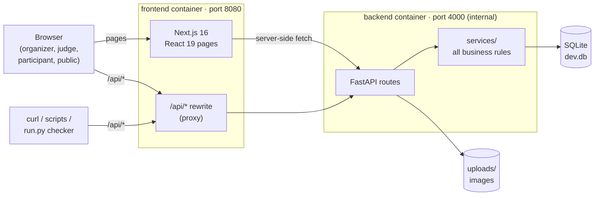
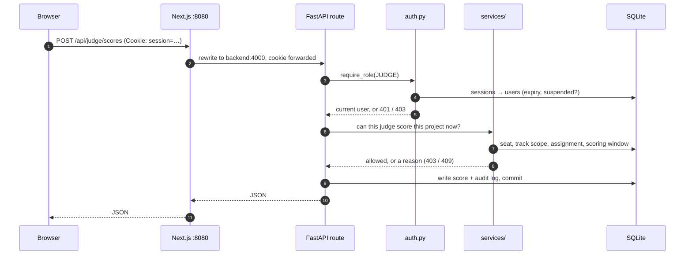
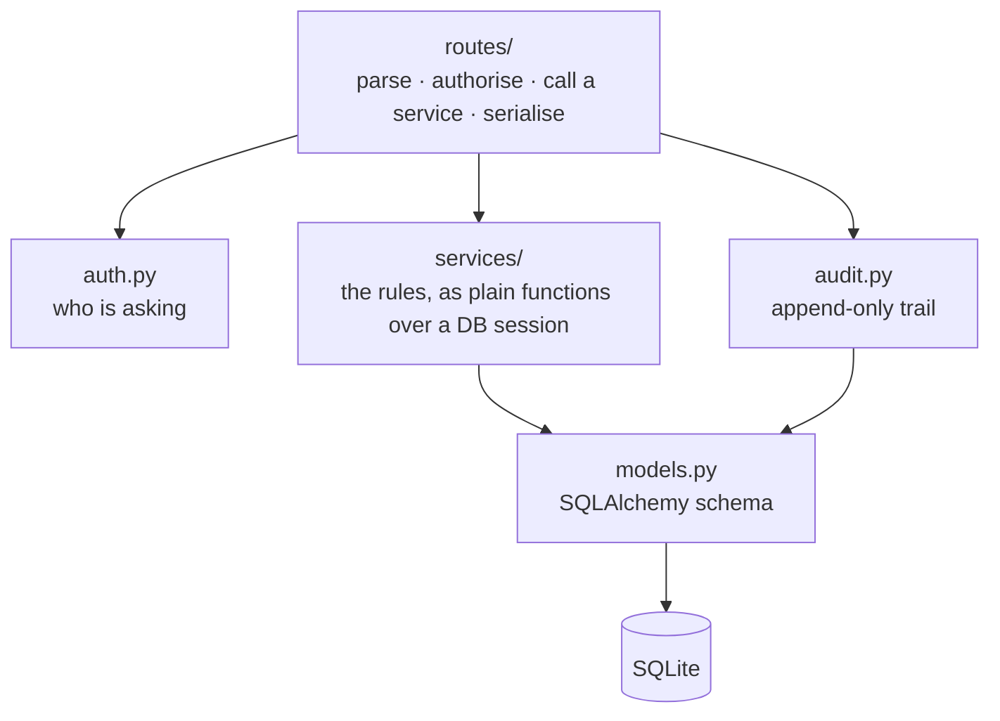
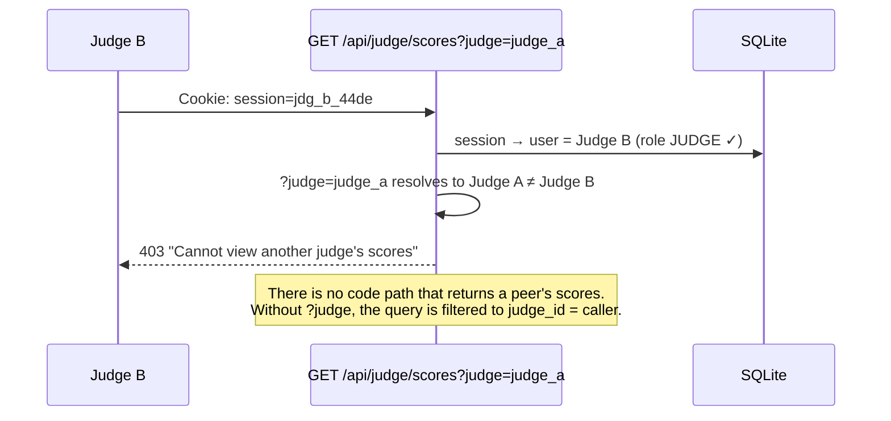
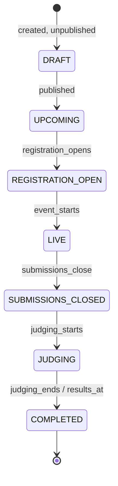
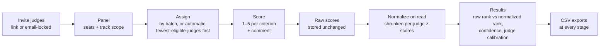
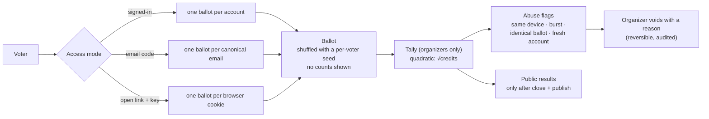
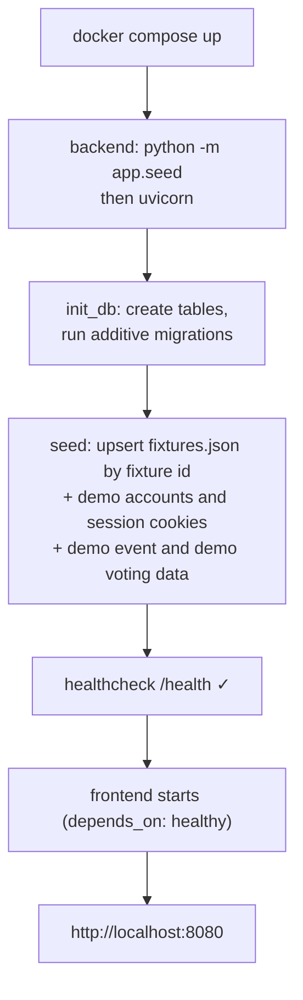

# Architecture

Hackboard is a self-hosted hackathon platform, built for the DOGFOOD 2026 hackathon. Organizers run events, participants form teams and submit
projects to a public gallery, judges score what they're assigned, and the public votes. It is one product for
every role, and it runs on a laptop with one command.

This document explains how the pieces fit together and why they were built this way. The schema is in
[DATA-MODEL.md](DATA-MODEL.md), the judging rules in [JUDGING.md](JUDGING.md), the score math in
[NORMALIZATION.md](NORMALIZATION.md) and community voting in [VOTING.md](VOTING.md).

## Contents

1. [The system at a glance](#1-the-system-at-a-glance)
2. [Repository map](#2-repository-map)
3. [How a request travels](#3-how-a-request-travels)
4. [Backend layers](#4-backend-layers)
5. [Frontend](#5-frontend)
6. [Authentication and isolation](#6-authentication-and-isolation)
7. [Event lifecycle](#7-event-lifecycle)
8. [Judging pipeline](#8-judging-pipeline)
9. [Community voting](#9-community-voting)
10. [Startup, seeding and data in and out](#10-startup-seeding-and-data-in-and-out)
11. [Key decisions](#11-key-decisions)
12. [Testing](#12-testing)
13. [Honest limitations](#13-honest-limitations)

---

## 1. The system at a glance



There are two processes and one data volume. `docker compose up` builds both images and starts them. The backend
creates the database and seeds it from `dog_food/fixtures.json` on every boot; seeding is idempotent. Nothing
calls the internet at runtime: no cloud account, hosted database, auth provider or email service. Fonts are
bundled into the frontend build.

**The one rule that shapes everything:** the backend owns every decision. Roles, deadlines, judge scope, voting
windows and rate limits are all enforced in Python. The frontend only decides what to *show*. The browser, `curl`
and the acceptance checker all reach the same API, so a rule that lived only in React would fail the moment
someone typed a URL.

## 2. Repository map

```
.
├── .dogfood.toml            acceptance-checker config: base URL, role headers, routes, tier claims
├── acceptance-report.txt    output of dog_food/run.py, committed as-is
├── docker-compose.yml       one command to a seeded portal
├── backend/                 FastAPI + SQLAlchemy 2 + SQLite (Python 3.12)
│   ├── app/
│   │   ├── main.py          app, router registration, boot hook (init DB, seed if empty)
│   │   ├── models.py        the whole schema (see DATA-MODEL.md)
│   │   ├── auth.py          session cookie → user, require_role()
│   │   ├── routes/          HTTP layer, one file per area (17 files, ~90 endpoints)
│   │   ├── services/        business rules: event_state, judging, normalization, voting,
│   │   │                    ratelimit, portable (import/export), audit, events, passwords
│   │   ├── lib/scoring.py   weighted rubric totals
│   │   ├── migrate.py       additive ALTER TABLE upgrades for existing databases
│   │   ├── seed.py          fixtures.json → database, demo accounts, demo voting data
│   │   ├── transfer.py      CLI: export / import a whole event
│   │   └── normalization_report.py   CLI: normalization proof on the fixtures
│   └── tests/               pytest suite (106 tests, fresh in-memory DB per test)
├── frontend/                Next.js 16 + React 19 + Tailwind v4 (TypeScript)
│   └── src/
│       ├── app/             routes (App Router): pages, plus api/auth/* route handlers
│       ├── components/      UI: judging console, voting, forms, gallery, ui/ primitives
│       └── lib/             api.ts (every API call + types), server-api.ts, format, auth helpers
├── dog_food/                official files: run.py, fixtures.json, spec.md
└── scripts/
    ├── acceptance_extra.py  our checker for T3, import/export and the normalization bonus
    └── start-dev.ps1        start both dev servers on Windows
```

## 3. How a request travels

The browser only ever talks to port 8080. Next.js serves pages and forwards every `/api/*` request unchanged to
FastAPI, so the browser sees a single origin and the session cookie just works.



Pages use one of two paths:

- **Server components** fetch through `lib/server-api.ts` straight to `BACKEND_URL`, forwarding the visitor's
  cookie, and render HTML. Examples: the gallery and project pages.
- **Client components** call `/api/*` through `lib/api.ts`, which holds every call and response type in one file.
  Examples: forms, the judging console and the ballot.

Login, register, logout and session are small Next route handlers (`src/app/api/auth/*`). They call FastAPI, set
the `HttpOnly` cookie on the portal's own origin, and forward the client IP for rate limiting.

> The `/api` rewrite target is fixed when Next builds, so the frontend Dockerfile receives `BACKEND_URL` as a
> build argument, not only at runtime.

## 4. Backend layers



| Layer | Contains | Rule |
|---|---|---|
| `routes/` | HTTP only | No business rule is written in a route that a service already owns |
| `services/` | Every decision, as functions that take a DB session | Testable without HTTP; routes and CLIs share them |
| `models.py` | Tables, constraints, relationships | Uniqueness is enforced by the database, not only by code |
| `audit.py` | `log_action(...)`, called by every write | The organizer's audit page reads this in plain language |

The services a reviewer is most likely to ask about:

| Service | Decides |
|---|---|
| `event_state.py` | The calendar: whether you can register, form teams, submit, score or vote right now. Both API and UI read phases from here. |
| `judging.py` | Who may see or score which project (panel seat, track scope, assignment, own-team exclusion); automatic assignment; duplicate detection; progress; results |
| `normalization.py` | Cross-judge normalization. Pure functions, no database, so the math can be tested and reproduced on its own |
| `voting.py` | Voter identity, shuffled ballots, the quadratic tally, abuse flags |
| `ratelimit.py` | A sliding-window limiter stored in the database, so there's no Redis to run |
| `portable.py` | Whole-event export and import in the `fixtures.json` shape |

## 5. Frontend

| Area | Routes | Main components |
|---|---|---|
| Public | `/`, `/events`, `/events/[slug]`, `/projects`, `/projects/[id]`, `/vote/[slug]` | Gallery filters, project page, comments, ballot |
| Participant | `/participant`, `/teams/*`, `/projects/new`, `/join/[token]` | Team pages, `SubmitForm` with image upload |
| Judge | `/judging`, `/judge-invite/[token]` | `JudgingDashboard`, `ScoreForm` |
| Organizer | `/organizer/dashboard`, `/organizer/events/[slug]` with `/judging`, `/voting`, `/audit`, `/edit`; `/organizer/import` | Judging console (progress, panel, assignments, rubric, results and exports), voting console, audit trail |
| Admin | `/admin` | Users, roles, suspension |

Role guards in the UI (`RoleGuards.tsx`) only choose what to render. Every one of those pages still gets `401` or
`403` from the API if the role is wrong.

## 6. Authentication and isolation

**Sessions.**
- Signing in creates a 32-byte random key, stored in the `sessions` table with a 14-day expiry. The browser holds
  it in an `HttpOnly`, `SameSite=Lax` cookie.
- Logout deletes the row, and changing the password deletes the user's other sessions.
- Passwords are hashed with scrypt.

**Roles.** `VISITOR → PARTICIPANT → JUDGE → ORGANIZER → ADMIN`. Every route calls
`require_role(db, request, [...])`: `401` if you're not signed in, `403` if your role is wrong.

**Judge isolation happens in the query, not the template.** This is the check the acceptance suite cares about
most:



A judge also only ever sees projects that pass all of these:

1. They have a **seat** on that event's panel.
2. The project is in one of their **tracks**, if their seat is track-scoped.
3. The project is **assigned** to them.
4. They are **not a member** of the project's team.

The same check guards project pages, drafts and scoring. `backend/tests/test_t2_judging.py` covers each
case.

## 7. Event lifecycle

An event's phase is computed from its dates on every request, never stored, so it can't drift out of date.



| Phase | What the backend allows |
|---|---|
| Registration open | Register, create and join teams |
| Live | Create, edit, submit and un-submit projects |
| After `submissions_close` | Every submission write returns `403`. The fixture event is seeded with its real, past deadline, which is why `run.py`'s "closed event refuses submissions" passes |
| Judging | Assigned judges score. Scoring outside the window returns `409` with the reason |
| Voting window (separate) | Community ballots; results stay hidden until the window closes and an organizer publishes them |

## 8. Judging pipeline



- **Raw scores are never overwritten.** Normalized values are computed when results are read, so changing a
  rubric weight re-ranks everything without touching stored data, and an auditor can always recompute by hand.
- **Rubric:** organizers weight each criterion. Adding criteria is blocked once scoring has started, but weights
  can still change.
- **The fixtures' awkward cases are handled on purpose:**
  - a judge who gave every project the same score gets a spread floor;
  - unfinished batches mean projects with fewer than 3 reviews are flagged as low confidence;
  - a duplicate submission ranks only the later copy.

  See [NORMALIZATION.md](NORMALIZATION.md), and reproduce it with `python -m app.normalization_report`.
- **Organizers watch it live** on the Progress tab: each judge's completion, and projects that are still short
  of reviews.

## 9. Community voting



Rate limits sit in front of every write: new ballots, email codes, code guesses, comments, sign-ups and failed
sign-ins. [VOTING.md](VOTING.md) defends quadratic voting and states its weakness: fake identities, which is why
the flags exist.

## 10. Startup, seeding and data in and out



- **Seeding is idempotent.** Rows are matched on their fixture id, so restarting never duplicates data. The fixed
  session cookies in `.dogfood.toml` (`org_7f2a` and the others) are re-created on every boot, so the checker
  always works.
- **Data in:**
  - the fixtures load on boot;
  - any event in the same JSON shape can be imported from `/organizer/import` or with
    `python -m app.transfer import`. Every import has a dry-run preview.
- **Data out:**
  - a whole event as JSON;
  - 11 kinds of CSV;
  - the SQLite file itself.

  An exported event re-imports into an empty portal unchanged; this is tested. Details are in
  [DATA-MODEL.md](DATA-MODEL.md#import-and-export-paths).

## 11. Key decisions

| Decision | Why | Cost |
|---|---|---|
| Two processes: Next.js and FastAPI | A typed UI and a Python backend where the rules and the math are easy to read and test. The proxy keeps one origin. | Two images to build. Rewrites must know the backend address when the frontend is built. |
| SQLite, one file | Runs on a laptop with zero setup, and a backup is one file copy. SQLAlchemy keeps Postgres one `DATABASE_URL` away. | One writer at a time. Fine at hackathon scale (hundreds of users), not for thousands voting in the same second. |
| Additive migrations in `migrate.py`, not Alembic | Every schema change so far only adds columns, so upgrading an old database needs no tooling. | Renames or drops would need Alembic. We'd add it before the first destructive change. |
| Portable ids (`fixture_id`) next to database ids | Imports are idempotent, and exports keep ids, so a round trip is lossless. | Two ids per row. The API uses database ids; files use portable ids. |
| Raw scores stored; normalization computed on read | Weights or method can change without rewriting data, and raw scores stay auditable. | Results are recomputed per request: milliseconds for 40 projects and 130 reviews. |
| Rate limits and the audit log in the database | No extra infrastructure. | Both tables grow. Old rate events can be pruned. |
| Quadratic voting by default | Rewards broad support over a loud minority. | Weak to fake identities, hence the identity modes and flags. |

## 12. Testing

| Layer | What | Run |
|---|---|---|
| Official acceptance | `dog_food/run.py`: 7 checks for T1 and T2 against the running portal | `python dog_food/run.py .dogfood.toml` |
| Our acceptance | `scripts/acceptance_extra.py`: 33 checks for T3, import/export and the normalization bonus, same style | `python scripts/acceptance_extra.py .dogfood.toml` |
| Backend | `backend/tests`: 106 pytest tests, a fresh in-memory database each | `cd backend && pytest` |
| Frontend | `tsc`, `eslint`, and the production build the Docker image runs | `cd frontend && npm run build` |

## 13. Honest limitations

- **Roles are platform-wide.** Any organizer can manage any event; there are no per-event organizer seats.
  Judges, on the other hand, are seated per event and per track.
- **No outgoing email.** Email-gated voting shows the code on screen and in the server log
  (`EMAIL_DEV_PREVIEW=1`). Production would plug a mail provider into `services/voting.py`.
- **T4 is mostly not built.** Only bulk import and export exist. There are no API keys or webhooks, no
  certificates or signed judge records, and no embeddable widget. The REST API works for scripts that send a
  session cookie.
- **The official checker covers only T1 and T2.** T3, import/export and the normalization bonus are verified by
  `scripts/acceptance_extra.py` and the backend tests. `.dogfood.toml` claims T1, T2 and T3, with a comment
  saying so.
